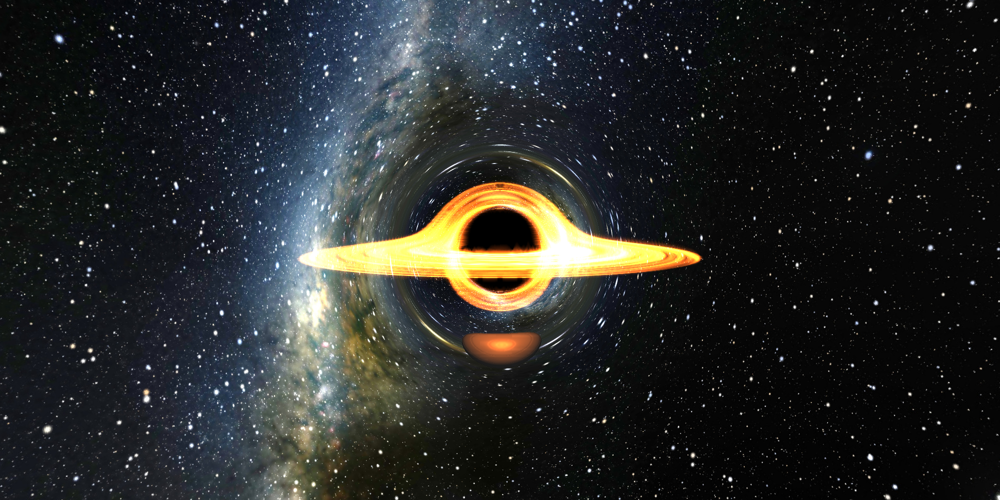
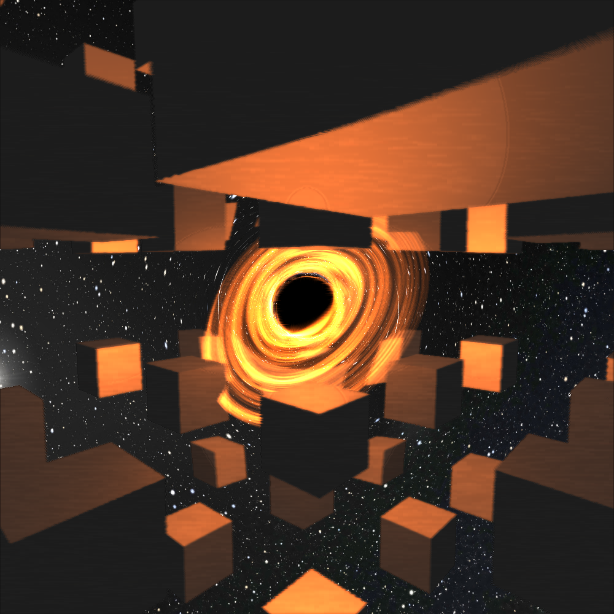

# cs179 final project: black hole raymarching engine



This project is a raymarcher that simulates the schwartzchild metric around a black hole, rendering the accretion disk and background relative to the distorted spacetime. Additionally, objects in the scene can be rendered using a fully customizable signed distance function (SDF). Finally, a bloom kernel is run to add more photorealism to the image.  

# How to Run

To generate the frames, make the project using the following commands:
```sh
mkdir build
cd build
cmake ..
make
./gpu_demo
```
This will put all frames into `frames_temp`. Then, `cd ..` and run `bash make_video.sh` to merge the frames into an mp4 file. 

To customize the scene, set new parameters within `gpu_demo.cu` and rerun `make`. The SDF function has an example that adds a grid of cubes, but can be set to anything else. 

The GPU implementation runs at around ~30fps on 2 A5000s. The CPU implementation has much fewer features, and also runs many orders of magnitude slower at around ~10s per frame. 

In the future, potential improvements include:
- Real time OpenGL interactive window
- Performance Optimization
- Reflections/refractions
- Multiple black holes
- Textures for SDFs

